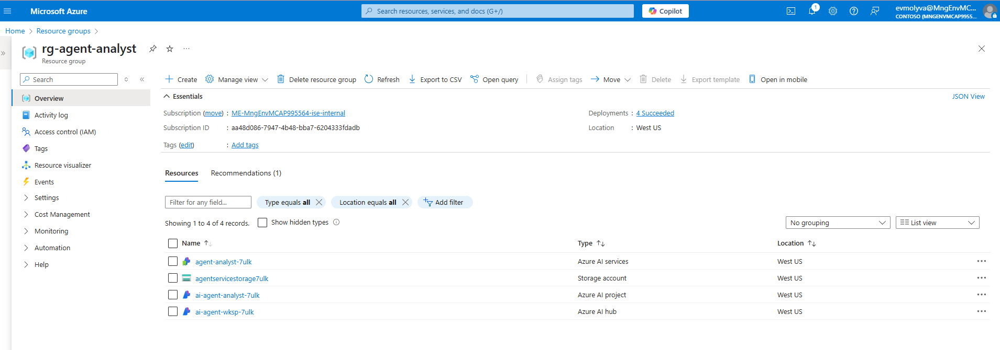

# Overview

This repository contains sample code for building a simple AI agent using Azure services.

The purpose of the AI Agent is to summarize and analyze organization data given the name of the organization.

## Prerequisites

- Docker (Desktop or Engine) is installed so that you can run the project using a devcontainer.
- Azure subscription with permissions to create resources and assign roles.

## Infrastructure

```bash
# login to Azure
az login

# navigate to the infrastructure directory
cd infrastructure

# copy and rename sample.env to .env
cp sample.env .env
# you can update these variable names if you want.

# run the deployment script
. ./deploy.sh
```

The `infrastructure/deploy.sh` script automates the deployment of Azure resources and performs several post-deployment tasks, ensuring all necessary resources and settings are prepared for the project. 

1. **Resource Group Creation**:
   - Creates a resource group named `rg-agent-analyst` in the `westus` region.

1. **Azure Resource Deployment**:
   - Deploys resources defined in the `main.bicep` file using the Azure CLI. Parameters like `aiHubName`, `aiProjectName`, `modelName`, and others are passed to customize the deployment.
   - The deployment output is saved to a file named `output.json`.

1. **Post-Deployment Configuration**:
   - Extracts deployment outputs (e.g., `aiProjectName`, `resourceGroupName`, `subscriptionId`) from `output.json`.
   - Retrieves the `discovery_url` of the deployed Azure Machine Learning workspace and processes it to generate a `PROJECT_CONNECTION_STRING`.

1. **Environment File Setup**:
   - Writes the `PROJECT_CONNECTION_STRING` and other configuration values to a `.env` file for a Python project.

1. **Role Assignment**:
   - Assigns the "Data Scientist" role to the current user for the created resource group, enabling necessary permissions.

1. **Cleanup**:
   - Deletes the `output.json` file after processing.

The provisioned resources include:

- [Azure AI Services](https://learn.microsoft.com/en-us/azure/ai-services/what-are-ai-services) (includes Azure OpenAI, Azure AI Agent Service, Azure AI Search and more)
- [Azure Storage Account](https://learn.microsoft.com/en-us/azure/storage/common/storage-account-overview)
- [Azure AI hub](https://learn.microsoft.com/en-us/azure/ai-foundry/how-to/create-azure-ai-resource?tabs=portal)
- [Azure AI project](https://learn.microsoft.com/en-us/azure/ai-foundry/how-to/create-projects?tabs=ai-studio)




# Run locally

1. Confirm the `src/api/.env` has been created succesfully and the `PROJECT_CONNECTION_STRING` is populated referencing the newly created resources. 

1. Create the sqlite database with organization data based on `src/api/database/organizaton_entities.sql` by running

   ```bash
   # navigate to the database directory
   cd ../src/api/database

   # generate database
   python generate_sql.py

   # confirm the database has been created (33 records)
   sqlite3 /workspaces/ai-agent/src/api/database/organizations.db "SELECT COUNT(*) FROM organizations"
   ```

1. Run the Analyst Agent API

   ```bash
   # navigate back to the api directory
   cd ..

   # run the API 
   fastapi dev main.py
   ```

   The API will load in which will load on http://127.0.0.1:8000/docs.
   
   Try out the GET /analyze endpoint by setting the query to a company name (e.g., Omni Labs)
